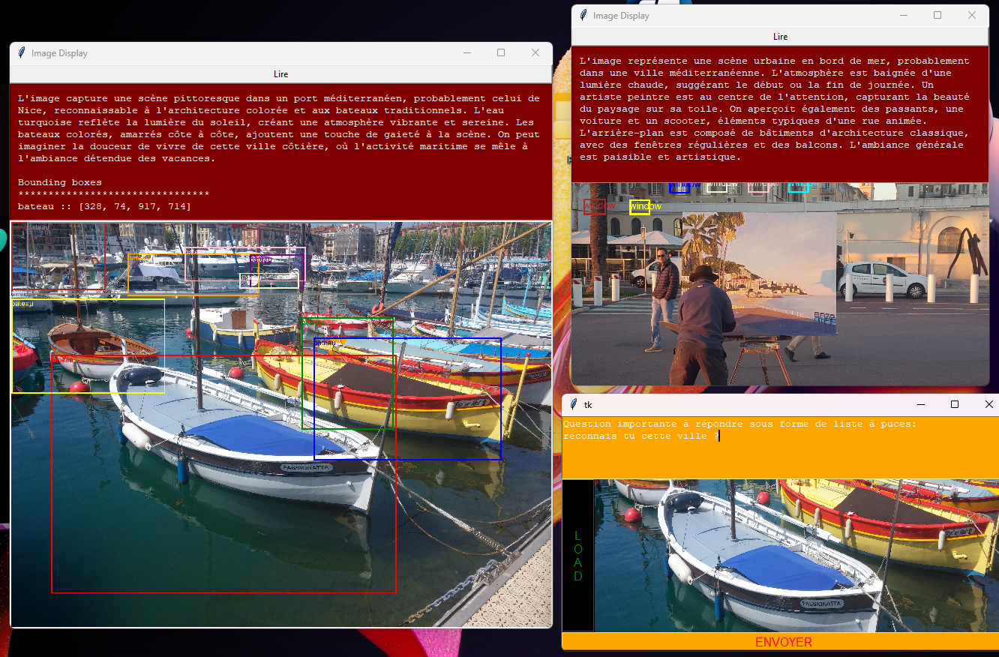

# API Gemini

## Description
Ce projet fournit une interface graphique pour analyser des images et générer des descriptions détaillées et des boîtes de délimitation (bounding boxes) en utilisant l'API Gemini.

## Installation
1. Clonez le dépôt :
    ```bash
    git clone <URL_DU_DEPOT>
    cd API_GEMINI
    ```

2. Installez les dépendances :
    ```bash
    pip install -r requirements.txt
    ```

## Utilisation
1. Exécutez le script principal :
    ```bash
    python hello_api.py
    ```

2. Utilisez l'interface graphique pour charger une image et envoyer une requête à l'API Gemini pour l'analyse.

## Configuration
Assurez-vous d'avoir un fichier `secret.py` contenant votre clé API Gemini :
```python
# secret.py
GEMINI_API_KEY = 'votre_cle_api_gemini'
```

## Dépendances
- `tkinter` : Pour l'interface graphique.
- `pyttsx3` : Pour la synthèse vocale.
- `Pillow` : Pour le traitement des images.
- `google-genai` : Pour interagir avec l'API Gemini.
- `Classes` : Module contenant les classes `Recipe` et `ImageLoad`.
- `visa_reco` : Module pour la reconnaissance et le traitement des images.

## Documentation

### hello_api.py
Ce module fournit une interface graphique pour charger des images, envoyer des requêtes à l'API Gemini et afficher les résultats.

#### Classes
- `HelloApi`: Classe principale pour l'interface graphique.

#### Méthodes
- `__init__(self)`: Initialise l'interface graphique.
- `load_image_file(self)`: Charge une image à partir d'un fichier.
- `surveillance(self, image, prompt_wdgt)`: Analyse l'image et génère une description détaillée et des boîtes de délimitation.

### Classes.py
Ce module définit les classes de données utilisées pour représenter les recettes et les coordonnées des boîtes de délimitation.

#### Classes
- `ListCoords`: Modèle de données représentant une boîte de délimitation étiquetée en 2D.
- `Recipe`: Classe utilisée pour représenter une recette.
- `ImageLoad`: Classe utilisée pour représenter un chargeur d'image.

### visa_reco.py
Ce module fournit des fonctions pour afficher des images avec des boîtes de délimitation colorées.

#### Fonctions
- `create_asyncio_task(async_function)`: Crée et exécute une tâche asyncio.
- `lire(texte)`: Lit le texte donné en utilisant un moteur de synthèse vocale.
- `alire(self, content)`: Démarre un nouveau thread pour exécuter une tâche asynchrone.
- `display_result(image, imag_title, content, good_boxes)`: Affiche une image dans une fenêtre Tkinter avec un titre et des widgets supplémentaires.
- `plot_bounding_boxes(target_file, boxes_coordinates, content)`: Trace des boîtes de délimitation sur l'image donnée et affiche le résultat.

## Auteur
Ce projet a été développé par [Votre Nom].

## Licence
Ce projet est sous licence MIT. Voir le fichier [LICENSE](LICENSE) pour plus de détails.